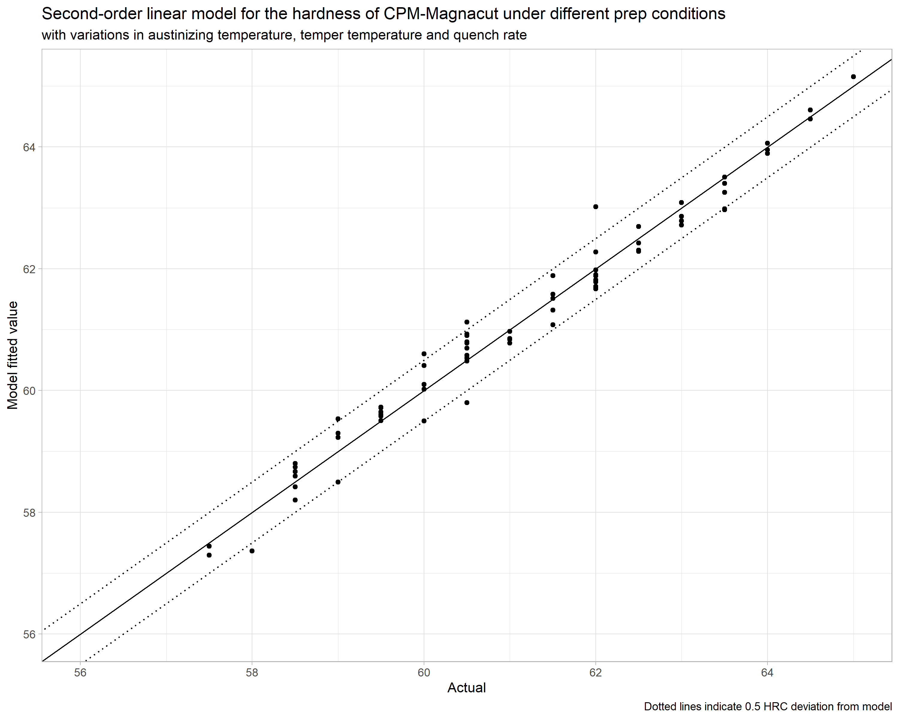
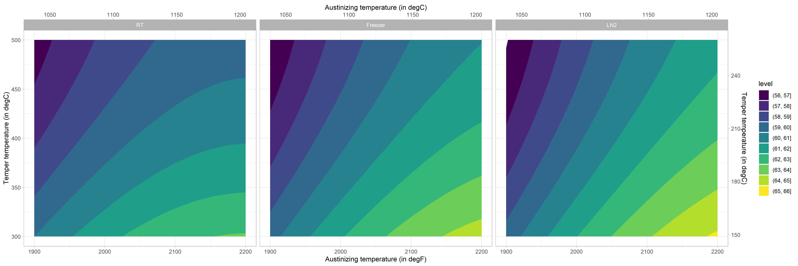

# knifesteelnerds

Larin Thomas from Knifesteelnerds.com presented some interesting data in a Youtube video. I was interested to see if a useful model could be built out of the data.

So far, there seems to be a well-fitting model with all factor (austinizing temperature, tempering temperature and quench method).

Model parameters:
```
|term           |estimate |std.error |p.value |
|:--------------|:--------|:---------|:-------|
|(Intercept)    |-95.88   |26.59     |<0.001  |
|aust           |0.15     |0.03      |<0.001  |
|I(aust^2)      |0.00     |0.00      |<0.001  |
|temper         |-0.05    |0.01      |<0.001  |
|I(temper^2)    |0.00     |0.00      |<0.001  |
|quenchLN2      |-6.06    |2.29      |0.010   |
|quenchRT       |11.36    |2.29      |<0.001  |
|aust:quenchLN2 |0.00     |0.00      |0.007   |
|aust:quenchRT  |-0.01    |0.00      |<0.001  |
```

giving a model with a good fit:
```
|r.squared |adj.r.squared |p.value |
|:---------|:-------------|:-------|
|0.9723    |0.9688        |<0.001  |
```




