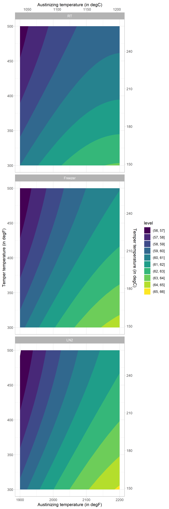

# knifesteelnerds

Larrin Thomas from [Knife Steel Nerds](http://www.knifesteelnerds.com) presented some interesting data about CPM-Magnacut in a [Youtube video](https://youtu.be/a5lzf8LA03o). I was interested to see if a useful model could be built out of the data.

So far, there seems to be a well-fitting linear model with all factor (austinizing temperature, tempering temperature and quench method).

```
hardness ~ aust + I(aust^2) + temper + I(temper^2) + quench + quench:aust
```

with model parameters:
```
|term           |estimate |std.error |p.value |
|:--------------|:--------|:---------|:-------|
|(Intercept)    |-95.8752 |26.5891   |<0.001  |
|aust           |0.1503   |0.0256    |<0.001  |
|I(aust^2)      |0.0000   |0.0000    |<0.001  |
|temper         |-0.0528  |0.0070    |<0.001  |
|I(temper^2)    |0.0000   |0.0000    |<0.001  |
|quenchLN2      |-6.0607  |2.2907    |0.010   |
|quenchRT       |11.3595  |2.2907    |<0.001  |
|aust:quenchLN2 |0.0031   |0.0011    |0.007   |
|aust:quenchRT  |-0.0058  |0.0011    |<0.001  |
```

giving a model with a good fit:
```
|r.squared |adj.r.squared |p.value |
|:---------|:-------------|:-------|
|0.9723    |0.9688        |<0.001  |
```



